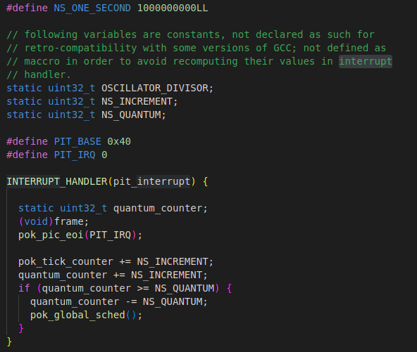

# 《实时系统与调度》设计与实现报告

小组成员： 邹立凯 吴泽一 蓝煜斌

项目仓库：https://github.com/lintonfirst/pok-sched.git

### GET STARTED

首先，从pok-kernel仓库中clone最新的main分支到本地，并以此为基础进行修改。

参照官网的get started配置环境，能够运行examples中的semaphore程序。

接着，参考官网的overview文档，熟悉pok的系统架构。由于不了解qemu调试的手法，只能通过阅读源代码和修改example程序看运行结果来推测其中的逻辑。

**时间片**



通过pit.c这个文件了解了时间片和调度的关系。pok里的1s定义为100000000，thread里配置deadline时数值要与这里的1s处于相近的数量级上。每次中断触发时，时间计数器会增加相当于NS_INCREMENT的数值，如果时间计数器的值达到了一个时间片（NS_QUANTUM），那么就会触发一次调度。每次调度时，线程对应的remaining_time_capacity就会减少1；在一个周期内，如果线程的remaining_time_capacity耗尽了，意味着该任务执行完毕，在同一个周期内不会再被调度。在实验中发现，线程的period和time_capacity属性是强相关的，不能随意修改，因此在我们的实验中，period和time_capacity的配置和semaphore示例程序中的配置处于相同的数量级。

**调度算法的配置**

参照semaphore示例，通过kernel文件中deployment.h中的POK_CONFIG_PARTITIONS_SCHEDULER宏定义项来决定内核使用哪一种调度策略。

在partition.c文件的pok_partition_setup_scheduler函数中，会根据POK_CONFIG_PARTITIONS_SCHEDULER来为该分区配置对应的调度函数。

因此，想要增加自己的调度策略，只需要按照以下函数原型完成自己的函数实现即可。

```cpp
uint32_t my_sched_func(const uint32_t index_low, const uint32_t index_high, const uint32_t prev_thread,const uint32_t current_thread);
```

由于不同的调度策略依赖不同的属性值，如优先级调度策略依赖priority，edf依赖deadline，wrr依赖权重，所以需要相应地增加pok_thread_t和pok_thread_attr_t的字段、改写thread初始化函数，才能支持这些新增的调度策略。

**为什么pok不支持动态创建线程**

在thread.c的pok_partition_thread_create函数中，有下列语句。

```cpp
if ((pok_partitions[partition_id].mode != POK_PARTITION_MODE_INIT_COLD) &&
    (pok_partitions[partition_id].mode != POK_PARTITION_MODE_INIT_WARM)) {
	return POK_ERRNO_MODE;
}
```

因此，当运行时尝试通过pok_thread_create函数创建线程时，由于当前不处于INIT阶段，会直接返回POK_ERRNO_MODE，导致创建失败。

**调试**

由于不会调试qemu，所以全靠printf打印进行调试。

printf主要打在用户态程序、thread.c和sched.c中，足够帮助我们找到bug的原因。

### 四种调度算法实现

调度算法实现在kernel/core/my_sched.c中。

**抢占式优先级调度**

思路是遍历当前partition中的所有线程，从状态为POK_STATE_RUNNABLE的线程中挑选出优先级最高的进行调度。状态为POK_STATE_RUNNABLE保证了线程的remaining_time_capacity不为0。如果所有用户态线程的时间片都用光了，会选择IDLE_THREAD进行调度。

```cpp
uint32_t my_sched_priority(const uint32_t index_low, const uint32_t index_high, const uint32_t prev_thread, const uint32_t current_thread) {
    uint32_t highest_property_thread = IDLE_THREAD;
    for(uint32_t index=index_low;index!=index_high;index++){
        if(pok_threads[index].state == POK_STATE_RUNNABLE && pok_threads[index].priority>pok_threads[highest_property_thread].priority){
            highest_property_thread=index;
        }
    }

    return highest_property_thread;
}
```

**edf调度**

首先要为pok_thread_t加上deadline_stamp属性，在线程激活时赋予值，值等于线程新的周期开始时刻加上线程的deadline。在调度时，遍历partition的所有线程，选择deadline_stamp最小的线程进行调度。

```cpp
uint32_t my_sched_edf(const uint32_t index_low, const uint32_t index_high, const uint32_t prev_thread, const uint32_t current_thread) {
    uint32_t highest_property_thread = IDLE_THREAD;
    for(uint32_t index=index_low;index!=index_high;index++){
        if(pok_threads[index].state != POK_STATE_RUNNABLE){
            continue;
        }
        if(pok_threads[index].deadline_stamp==0){
            continue;
        }
        if(highest_property_thread == IDLE_THREAD){
            highest_property_thread=index;
            continue;
        }
        if(pok_threads[index].deadline_stamp<pok_threads[highest_property_thread].deadline_stamp){
            highest_property_thread=index;
        }
    }

    return highest_property_thread;
}
```

**round robin调度**

首先要为pok_thread_t加上budget属性。如果当前运行的线程还有剩余的budget，那么就继续运行，消耗一份budget；如果当前运行的线程没有budget，那么就从下一个线程开始寻找一个可运行的线程，为其补充4份budget，并调度该线程。

```cpp
uint32_t my_sched_rr(const uint32_t index_low, const uint32_t index_high, const uint32_t prev_thread, const uint32_t current_thread) {
    uint32_t selected = IDLE_THREAD;
    if (pok_threads[current_thread].state == POK_STATE_RUNNABLE
        && pok_threads[current_thread].remaining_time_capacity > 0 && pok_threads[current_thread].budget > 0) {
        pok_threads[current_thread].budget--;
        return current_thread;
    }
    for(uint32_t index=current_thread;index!=current_thread+index_high-index_low;index++){
        int idx=index%(index_high-index_low)+index_low;
        if(pok_threads[idx].state == POK_STATE_RUNNABLE){
            selected=idx;
            break;
        }
    }
    if(selected!=IDLE_THREAD){
        pok_threads[selected].budget=4;
    }
    return selected;
}
```

**weighted round robin调度**

要为pok_thread_t加上weight属性。算法流程和round robin是相同的，但是在调度新线程补充budget时，不再是一个常数，而是常数乘上一个weight。这样，高权重的线程能有更长的连续运行时间，因此能相对更快地被执行。

### 动态增加线程实现

修改thread.c中的pok_partition_thread_create函数。

```cpp
// if ((pok_partitions[partition_id].mode != POK_PARTITION_MODE_INIT_COLD) &&

//     (pok_partitions[partition_id].mode != POK_PARTITION_MODE_INIT_WARM)) {

//   return POK_ERRNO_MODE;
// }
```

首先注释掉这部分代码，这部分代码规定只有init阶段可以创建线程。然后为thread_attr增加一个isDynamic字段，动态创建线程时，需要将该字段配置为1（默认为0），在pok_partition_thread_create中根据isDynamic判断线程是否需要进行额外的初始化(这个初始化可能是不必要的）。

```cpp
if(attr->isDynamic){
    pok_threads[id].period = INFINITE_TIME_VALUE;
    pok_threads[id].deadline = 0;
    pok_threads[id].schednum = 0;
    pok_threads[id].dependId = -1;
    pok_threads[id].deadline_stamp = 0;
    pok_threads[id].budget = 0 ;
    pok_threads[id].priority = 0 ;
    pok_threads[id].time_capacity = INFINITE_TIME_VALUE;
    pok_threads[id].remaining_time_capacity = INFINITE_TIME_VALUE;
    pok_threads[id].next_activation = 0;
    pok_threads[id].wakeup_time = 0;
    pok_threads[id].state = POK_STATE_STOPPED;
    pok_threads[id].processor_affinity = 0;
}
```

### MLFQ算法与实现
### 相互依赖的多任务并行应用场景

假设有这么一个场景，处理器要通过网络请求视频流（每次获取一帧图像），然后使用unet网络进行图像检测，然后将存在问题的图像信息通过网络发送出去。

**请求视频帧**

该任务需要300000个循环，然后将frameCounter数值+1。

```cpp
static void fetch_video_frame() {
    while(1){
        for (int i=0;i<300000;i++) {
            ;
        }
        frameCounter+=1;
        printf("fetch: frameCounter %u,processCounter %u,sendCounter %u\n",frameCounter,processCounter,sendCounter);
    }
}
```

**图像检测**

该任务依赖于请求视频帧，有未处理的视频帧时才能执行检测任务。

该任务需要200000个循环，然后将processCounter数值+1。

我们假设processCounter是3和7的倍数时，会检测出图像问题。

```cpp
static void unet_segmentation() {
    while(1){
        if(frameCounter>processCounter){
            for (int i=0;i<200000;i++) {
                
            }
            processCounter+=1;
            if(processCounter%3==0||processCounter%7==0){
                detectedNum+=1;
            }
        }
        printf("unet: frameCounter %u,processCounter %u,sendCounter %u\n",frameCounter,processCounter,sendCounter);
    }
}
```

**发送检测结果**

该任务依赖于图像检测，当检测出的问题图像数量达到10时会进行批量发送。

```cpp
static void send_processed_frame() {
    while(1){
        if(detectedNum>10){
            for (int i=0;i<150000;i++) {
                ;
            }
            detectedNum-=10;
            sendCounter+=1;
        }
        printf("send: frameCounter %u,processCounter %u,sendCounter %u\n",frameCounter,processCounter,sendCounter);
    }
}
```

**时间耗费**

任务一周期100000000，time_capacity为30；

任务二周期100000000，time_capacity为20;

任务三周期500000000，time_capacity为15;

### 多任务并行下考虑依赖关系的调度算法设计与实现

在实验在发现，内核态里无法读取用户态中的变量，也无法执行用户态中的函数，这给调度带来了困难。原来的理想调度策略是这样的，在调度函数中判断依赖关系是否满足，只有满足时才会调度线程，避免用户态任务的idle开销。

实际做法是给pok_thread_t增加了一个依赖线程的字段dependId和被调度次数的计数器。在round robin调度策略的基础上，针对图像检测任务对请求视频帧任务的依赖，如果调度次数领先数量小于5则不调度图象处理线程；如果调度次数领先数量大于12,则给图象处理线程额外的budget，提高处理速度。

```cpp
uint32_t my_sched_depend(const uint32_t index_low, const uint32_t index_high, const uint32_t prev_thread, const uint32_t current_thread) {
    uint32_t selected = IDLE_THREAD;
    if (pok_threads[current_thread].state == POK_STATE_RUNNABLE
        && pok_threads[current_thread].remaining_time_capacity > 0 && pok_threads[current_thread].budget > 0) {
        pok_threads[current_thread].budget--;
        return current_thread;
    }
    for(uint32_t index=index_low;index!=index_high;index++){
        if(pok_threads[index].state == POK_STATE_RUNNABLE && index!=current_thread){
            if(pok_threads[index].dependId>=0){
                uint32_t data=pok_threads[index].schednum;
                uint32_t dependdata=pok_threads[pok_threads[index].dependId].schednum;
                if(data+5>dependdata){
                    continue;
                }
                if(data+12<dependdata){
                    pok_threads[selected].budget+=2;
                }
            }
            selected=index;
            break;
        }
    }
    if(selected!=IDLE_THREAD){
        pok_threads[selected].budget=4;
    }
    pok_threads[selected].schednum+=1;
    return selected;
}
```

