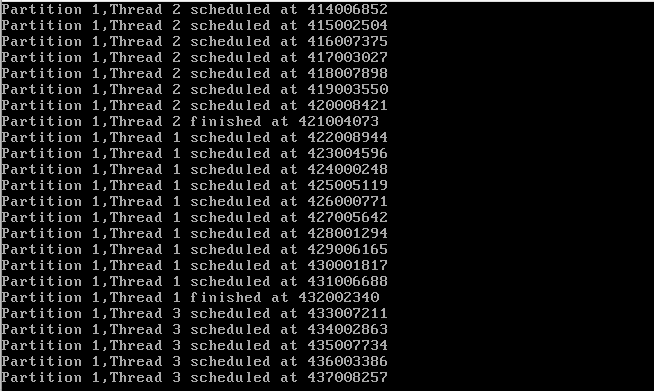
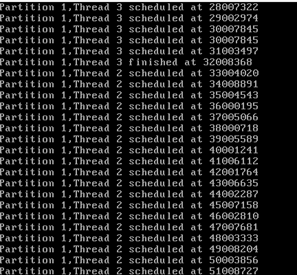
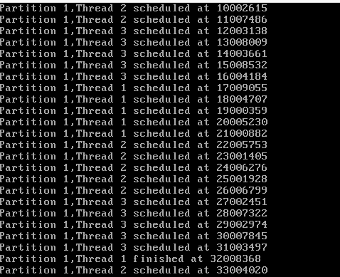
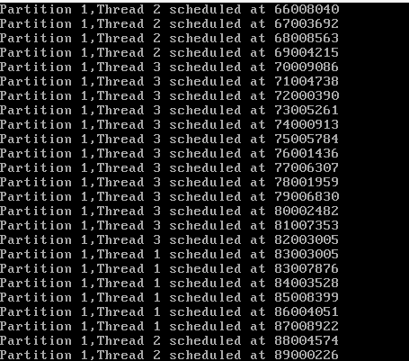
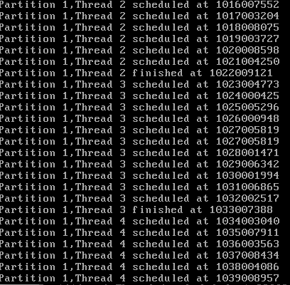
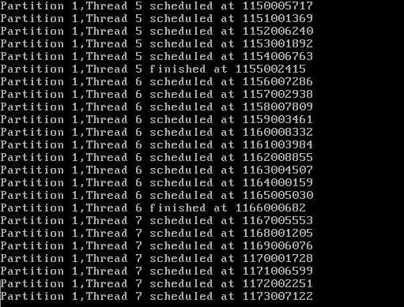
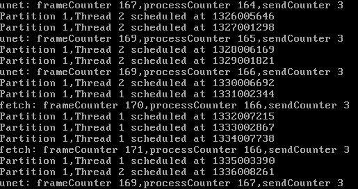

# 《实时系统与调度》测试报告

小组成员： 邹立凯 吴泽一 蓝煜斌

项目仓库：https://github.com/lintonfirst/pok-sched.git

### 调度算法

**抢占式优先级调度**

测试程序见于experiments/priority,创建三个不同优先级的线程进行实验

```cpp
tattr.period = 100000000;
tattr.time_capacity = 10;
tattr.priority = 30;
tattr.entry = task;
pok_thread_create(&tid, &tattr);

tattr.period = 80000000;
tattr.time_capacity = 20;
tattr.priority = 50;
tattr.entry = task;
pok_thread_create(&tid, &tattr);

tattr.period = 100000000;
tattr.time_capacity = 30;
tattr.priority = 20;
tattr.entry = task;
pok_thread_create(&tid, &tattr);
```



从这张截图中可以看到，thread2优先级最高，先被调度；当thread2的ramaining_time_capacity用完后，次高优先级的thread1被调度；最后才轮到thread3.可以看出优先级调度算法被正确地执行了。

**edf调度**

周期和time_capacity的配置与之前相同。

```cpp
tattr.period = 100000000;
tattr.time_capacity = 10;
tattr.deadline = 100000000;
tattr.entry = task;
pok_thread_create(&tid, &tattr);

tattr.period = 80000000;
tattr.time_capacity = 20;
tattr.deadline = 60000000;
tattr.entry = task;
pok_thread_create(&tid, &tattr);

tattr.period = 100000000;
tattr.time_capacity = 30;
tattr.deadline = 50000000;
tattr.entry = task;
pok_thread_create(&tid, &tattr);
```



这是最早的一个周期中的调度截图，thread3有最近的deadline，所以先运行thread3，然后再运行thread2；thread1的deadline最为宽松，最后运行，没有出现在截图中。

**round robin调度**

周期和time_capacity的配置与之前相同。

```cpp
tattr.period = 100000000;
tattr.time_capacity = 10;
tattr.entry = task;
pok_thread_create(&tid, &tattr);

tattr.period = 80000000;
tattr.time_capacity = 20;
tattr.entry = task;
pok_thread_create(&tid, &tattr);

tattr.period = 100000000;
tattr.time_capacity = 30;
tattr.entry = task;
pok_thread_create(&tid, &tattr);
```



从截图中可以看到，3个线程轮流被调度，在remaining_time_capacity允许的情况下每个线程会连续运行5个时间片（首次被调度时补充4个budget，且不消耗budget）

**weighted round robin调度**

周期和time_capacity的配置与之前相同，但设置了不同的权重。

```cpp
tattr.period = 100000000;
tattr.time_capacity = 10;
tattr.weight = 1;
tattr.entry = task;
pok_thread_create(&tid, &tattr);

tattr.period = 80000000;
tattr.time_capacity = 20;
tattr.weight = 2;
tattr.entry = task;
pok_thread_create(&tid, &tattr);

tattr.period = 100000000;
tattr.time_capacity = 30;
tattr.weight = 3;
tattr.entry = task;
pok_thread_create(&tid, &tattr);
```



从截图中可以看到，thread3连续运行了13（3\*4+1）个时间片，thread1运行了5（1\*4+1）个时间片,wrr算法被正确地执行了。

### 动态创建线程

在初始线程中动态创建了7个子线程，使用优先级调度策略。

```cpp
static void task() {
    for (int i=0;i<7;i++) {
        uint32_t tid;
        pok_thread_attr_t tattr;
        memset(&tattr, 0, sizeof(pok_thread_attr_t));
        tattr.period = 100000000;
        tattr.time_capacity = 10;
        tattr.priority = 30;
        tattr.entry = job;
        pok_ret_t ret=pok_thread_create(&tid, &tattr) ;
        if (ret == POK_ERRNO_OK) {
            printf("Thread %u created dynamically\n",tid);
        }
        else{
            printf("error %u\n",ret);
        }
    }
    // pok_thread_wait_infinite();
}

static void job() {
    printf("start job\n");
    for (;;) {
    }
}
```






从截图中可以看到，创建的子线程都有被调度执行。

### 多任务依赖

运行过程截图



**使用rr调度策略**

frameCounter达到150花费的时间： 33s

frameCounter达到250花费的时间：125s

**使用特殊设计的调度策略**

frameCounter达到150花费的时间：38s

frameCounter达到250花费的时间：109s

**比较与分析**

上述的统计结果是分别做三次实验后取时间中位数的结果，可以看到特殊设计的调度策略在效率上有一定优势。

特殊设计的调度策略的效率优势在设计报告中已进行了分析，它主要能够避免图象处理线程空转的情形，并通过time_capacity补偿机制提高了一个周期内的frameCounter增加量，从而提高效率，实验结果与理论相符。

不过，在实验过程中发现每次实验时间测量的波动很大。实验主要通过printf获得运行信息，而printf运行的时间不稳定，会导致测量结果不准。如果能通过非prinf的方法获取到实验信息，实验结果会更加可靠。